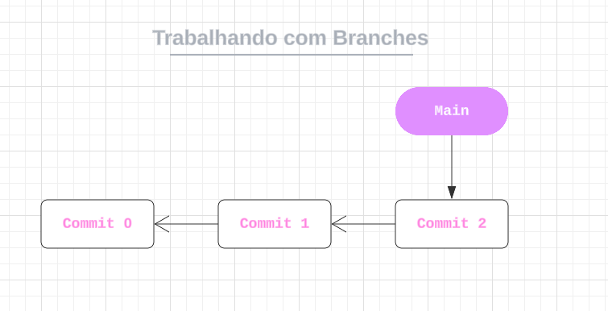

# Trabalhando com Branches
 
Branches são uma espécie de ramificação do projeto.

 - 📦 É um **ponteiro móvel** para um _commit_ no histórico do repositório

 - ⬆ Uma nova _branch_ a partir de outra existente inicia-se apontando para o mesmo _commit_ da _Branch_ que estava quando foi criada.

